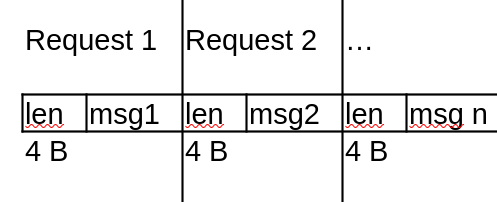

TODO:

1. [x] Split code to logical steps
2. Create task with each step described and hints if needed, specify request format
3. Create client that can be used for testing and debugging purposes
4. Create a presentation about NIO:
    - Event loop
    - How to work with Selector, Channel, Buffer (cheatsheet), Selection key
    - Closed socket (EOF), still connected, still valid
5. Add maven wrapper
6. Create tests
7. Create warmup task

# Simple event loop

## Protocol

A simple binary protocol over TCP:

- first 4-byte integer - length of message
- actual message

## Steps to implement event loop

1. S

- Start non-blocking listening socket
- Infinite loop listen for events
- Handle new client
- Handle read (closed connections)
- Handle request parse message
- Handle write
- Handle closing client